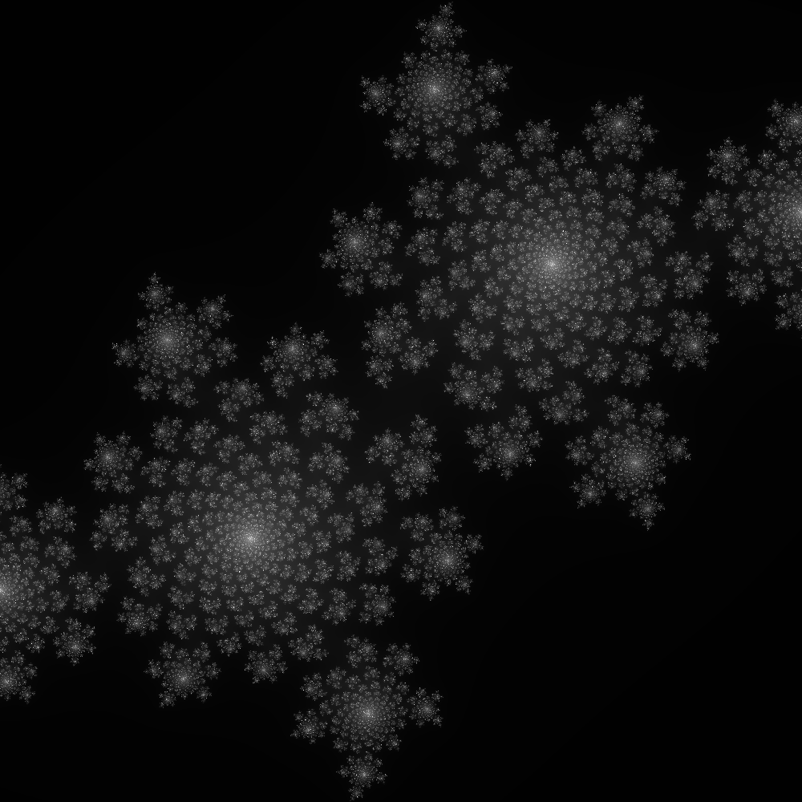

# Fractals and GPU Computing — Bachelor's Thesis

> Bachelor's Thesis — Babeș-Bolyai University, Faculty of Mathematics and Computer Science, 2025  
> Author: Cernăuțan Teofan-Ioan

This project explores the generation of Julia set fractals accelerated through GPU computing using CUDA. Each implementation represents a different memory model or optimization strategy, allowing direct performance comparison between CPU and GPU approaches.

The full written thesis (49 pages) is included in this repository as a PDF, covering the theoretical background of fractals, GPU computing, and the optimization methods used.

---

## Fractal Output

The program generates Julia set fractals — a family of complex plane fractals defined by iterating a function with a configurable complex number parameter `c`. Different values of `c` produce dramatically different fractal shapes, including forms closely resembling the Mandelbrot set.




---

## Implementations

The project contains five implementations, each in its own folder:

| Folder | Description |
|---|---|
| `CPUversion` | Baseline CPU implementation — no GPU acceleration |
| `GPUclassic` | Standard CUDA GPU implementation using global memory |
| `GPUunified` | CUDA unified memory model — prioritises stability and consistency over raw speed |
| `GPUPitchedSimple` | Pitched memory allocation — significantly faster, optimal for smaller image sizes |
| `GPUPitchedBlock` | Pitched memory with dynamic block sizing — maintains consistent performance advantage at very large image sizes |

### Performance Ranking (slowest → fastest)

**CPU → GPUunified → GPUclassic  → GPUPitchedSimple / GPUPitchedBlock**

- GPU implementations are substantially faster than the CPU version
- GPUunified trades some speed for memory access stability compared to GPUclassic
- Both Pitched implementations offer the best performance; GPUPitchedBlock holds its advantage more consistently as image resolution scales up

---

## Program Output

When run, the program:
1. Generates the fractal on the GPU
2. Prints the **GPU computation time** to the console
3. Opens the resulting PNG image after rendering (note: the CPU-side image writing step can take a while for large resolutions)

The complex number `c` can be modified directly in the source code to produce different Julia set variations.

---

## Setup & Requirements

This project was built with an older CUDA and GLUT setup. Getting it running requires:

- **CUDA Toolkit** (version compatible with your GPU)
- **GLUT** — library files are included inside the project folder
- **GLEW** — the zip file included in this repository; extract and link manually
- **Visual Studio** with CUDA extension

### Linking GLUT on Windows

1. Copy the GLUT `.lib` files to your Visual Studio library path (e.g. `C:\Program Files\Microsoft Visual Studio\VC\lib`)
2. Copy the GLUT `.dll` files to `C:\Windows\System32`
3. Copy the GLUT `.h` header to your Visual Studio include path (e.g. `C:\Program Files\Microsoft Visual Studio\VC\include\GL\`)

> ⚠️ This project was developed on a specific machine configuration and may require additional path adjustments depending on your setup. It is provided primarily as a reference and proof of work rather than a ready-to-run project.

---

## Repository Structure

```
/Fractal-test                            - Contains implementations for all the versions stated
glew-2.1.zip                             - GLEW library (extract and link manually)
Fractals_and_GPU_Computing.pdf           - Full 49-page written thesis document
README.md
LICENSE
```

---

## References

The CUDA project structure and fractal base implementation are adapted from:

> *CUDA by Example: An Introduction to General-Purpose GPU Programming* — Jason Sanders & Edward Kandrot (NVIDIA)

---

## License

The source code in this repository is licensed under the **MIT License** — see `LICENSE` for details.

The thesis document (`Thesis.pdf`) is © Cernăuțan Teofan-Ioan, all rights reserved.
